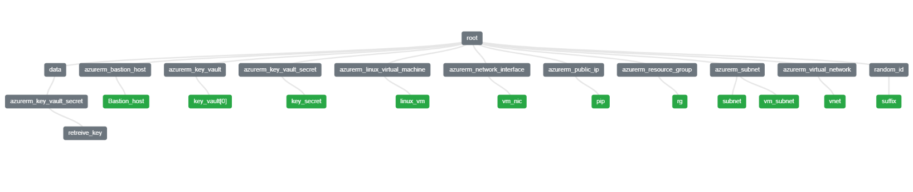

# Déploiement Azure Bastion + VM avec Terraform
## Qu'est-ce qu'Azure Bastion ?
Azure Bastion est un service PaaS entièrement managé qui permet un accès sécurisé et privé à vos machines virtuelles Azure, sans exposer d’adresse IP publique ni ouvrir les ports RDP/SSH.

Il remplace l’usage traditionnel d’une Jump Box — une machine intermédiaire avec un système d’exploitation serveur utilisée pour accéder au réseau interne — en offrant une alternative plus simple, plus sécurisée et native à Azure.

Plusieurs modes de connexion sont pris en charge :

- Interface graphique via le **portail Azure**,
- Ligne de commande avec **az network bastion ssh**,
- Tunnel local avec **az network bastion tunnel**.

## Architecture déployée
Ce step-by-step déploie une infrastructure réseau sécurisée avec Azure Bastion, une VM Linux et un Key Vault pour stocker la clé SSH.

Ce schéma a été généré via l'outil **Terraform Visual**, permettant de visualiser le graphe des ressources.

## Prérequis
- Terraform ≥ 1.5
- Azure CLI
- Subscription Azure valide
- Une paire de clés SSH (id_rsa et id_rsa.pub) dans le dossier du projet
    
    On peut aussi générer une paire de clés SSH avec la ressource Terraform **tls_private_key**.

## Déploiement & Connexion
1- Initialiser le projet Terraform

     terraform init
2- Vérifier le plan d’exécution

    terraform plan
3- Déployer l’infrastructure

     terraform apply
4- Se connecter à la VM via Azure Bastion (tunneling)

Ouvrir un tunnel sécurisé vers la VM :

    az network bastion tunnel --name Staging-Bastion-Bastion \
        --resource-group Staging-Bastion-rg-a991 \
        --target-resource-id {vm-id} \
        --port 10022 \
        --resource-port 22
     Cela ouvre un tunnel local (port 10022) redirigé vers le port 22 de la VM distante via Bastion.

 Puis, dans un second terminal :

    ssh -i id_rsa testadmin@127.0.0.1 -p 10022      