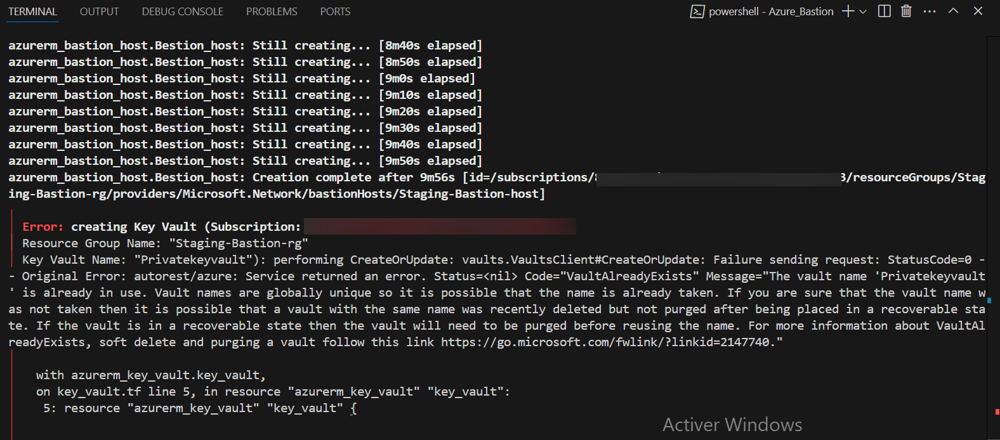

# Déploiement Azure Bastion + VM avec Terraform
## Qu'est-ce qu'Azure Bastion ?
Azure Bastion est un service PaaS entièrement managé qui permet un accès sécurisé et privé à vos machines virtuelles Azure, sans exposer d’adresse IP publique ni ouvrir les ports RDP/SSH.

Il remplace l’usage traditionnel d’une Jump Box — une machine intermédiaire avec un système d’exploitation serveur utilisée pour accéder au réseau interne — en offrant une alternative plus simple, plus sécurisée et native à Azure.

Plusieurs modes de connexion sont pris en charge :

- Interface graphique — **portail Azure**,
- Ligne de commande — **az network bastion ssh**,
- Tunnel local — **az network bastion tunnel**.

## Architecture déployée
Ce step-by-step déploie une infrastructure réseau sécurisée avec Azure Bastion, une VM Linux et un Key Vault pour stocker la clé SSH.

Ce schéma a été généré via l'outil **Terraform Visual**, permettant de visualiser le graphe des ressources.

## Prérequis
- Terraform ≥ 1.5
- Azure CLI
- Subscription Azure valide
- Une paire de clés SSH (id_rsa et id_rsa.pub) dans le dossier du projet
    
    On peut aussi générer une paire de clés SSH avec la ressource Terraform **tls_private_key**.

### Génération des clés SSH
Génération manuelle d'une paire de clés SSH avec :

    ssh-keygen -t rsa -b 4096 -f ./id_rsa
 > Cela créera deux fichiers : id_rsa (clé privée) et id_rsa.pub (clé publique).   

## Déploiement & Connexion
1- Initialiser le projet Terraform

     terraform init
2- Vérifier le plan d’exécution

    terraform plan
3- Déployer l’infrastructure

     terraform apply

   

4- Se connecter à la VM via Azure Bastion (tunneling)

Ouvrir un tunnel sécurisé vers la VM :

    az network bastion tunnel --name Staging-Bastion-Bastion \
        --resource-group Staging-Bastion-rg-a991 \
        --target-resource-id {vm-id} \
        --port 10022 \
        --resource-port 22
  > Cela ouvre un tunnel local (port 10022) redirigé vers le port 22 de la VM distante via Bastion.

 Puis, dans un second terminal :

    ssh -i id_rsa testadmin@127.0.0.1 -p 10022  
## Destruction de l'infrastructure

    terraform destroy
## Remarques importantes
- **Azure Key Vault** applique une suppression douce (soft delete) avec protection contre la purge activée par défaut. Cela peut empêcher non seulement la suppression complète du key vault, mais aussi sa recréation avec le même nom.

Pour contourner cela, on peut activer les options suivantes dans le provider **Azurerm** Terraform :

- Seul le propriétaire de la souscription "Owner" ou un utilisateur disposant du rôle RBAC "Key Vault Purge Operator" peut purger un Key Vault.

## Ressources utiles
- https://learn.microsoft.com/en-us/azure/key-vault/general/soft-delete-overview